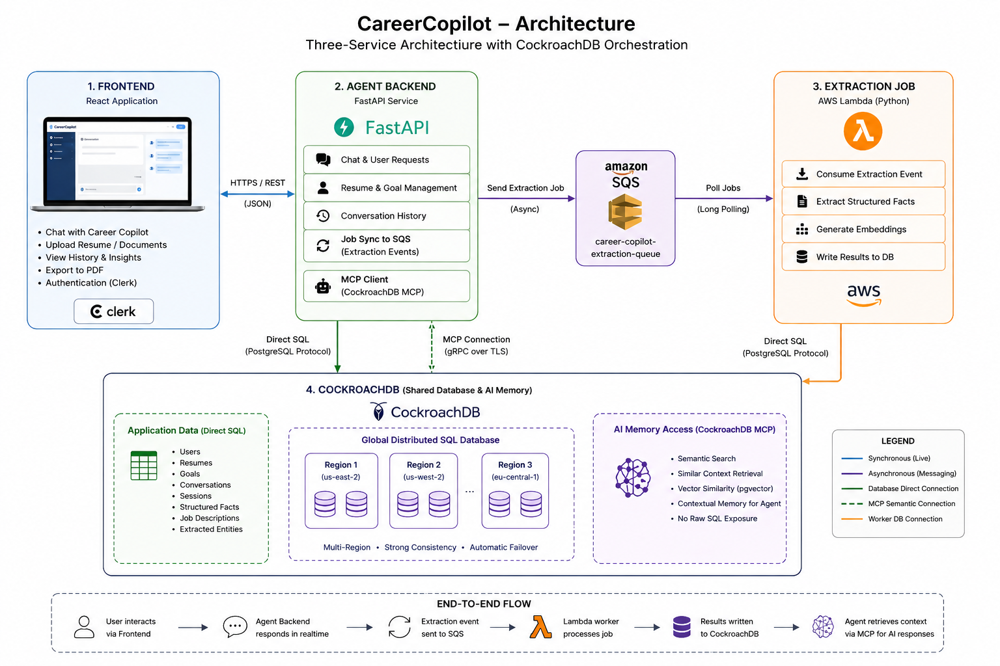

# CareerCopilot

## Overview
Career Copilot is an AI-powered career development platform that helps users optimize their resumes, analyze job descriptions, prepare for interviews, and receive personalized career guidance using large language models and semantic search.

CareerCopilot uses a three-service architecture built for AI-powered career assistance.
The system separates user-facing behavior, background extraction, and UI into independent services.

## Components

### Frontend
- User-facing React application
- Connects directly to the Agent Backend for realtime chat and uploads
- Handles authentication, display, and PDF export

### Agent Backend
- Central service handling user-facing logic
- Responds directly to frontend requests
- Maintains an MCP connection for semantic AI memory access
- Uses CockroachDB for application data and synchronizes extraction work

### Extraction Job
- Background AWS Lambda worker
- Processes queued extraction events asynchronously
- Extracts structured facts and semantic embeddings from conversations
- Writes results back into CockroachDB for later AI retrieval

## Messaging

### SQS Queue
- Buffers completed extraction events between the Agent Backend and Extraction Job
- Enables the extraction worker to scale independently of the live chat service
- Prevents direct coupling between live request handling and extraction processing

## Data Layer — CockroachDB

The shared CockroachDB backend is used for both direct application state and AI memory.

1. **Direct Postgres connection** — standard read/write access for resumes, goals, history, and structured records
2. **CockroachDB MCP** — semantic AI access for the agent to query context-relevant data without raw SQL

## Why this architecture

The three-service design keeps frontend UX, backend request handling, and background extraction separate.
This improves scalability, reduces latency in the live experience, and allows AI memory workflows to evolve independently.

## Links

- Website link: [Career Copilot Website](https://main.dyuw7p8j9543o.amplifyapp.com/)